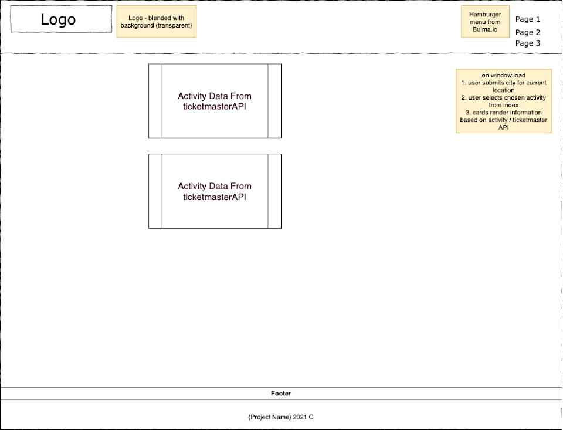
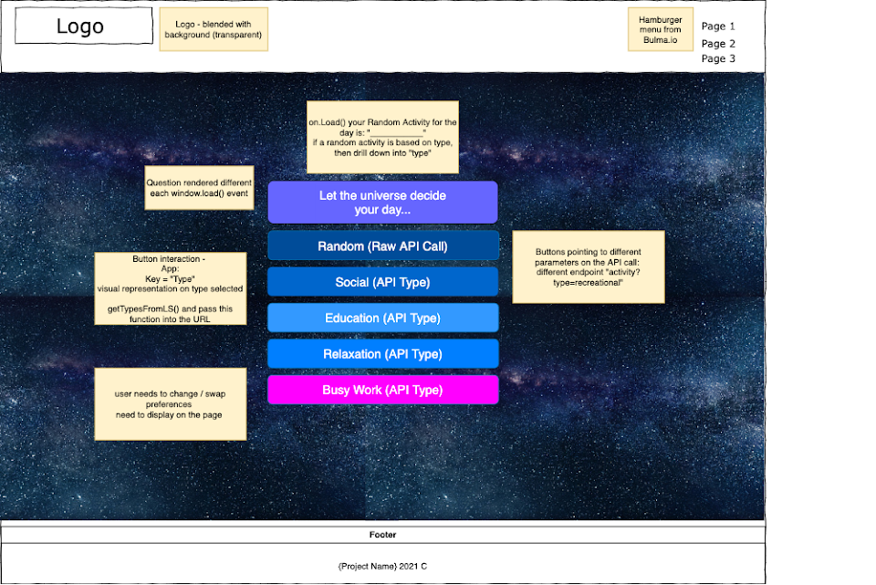
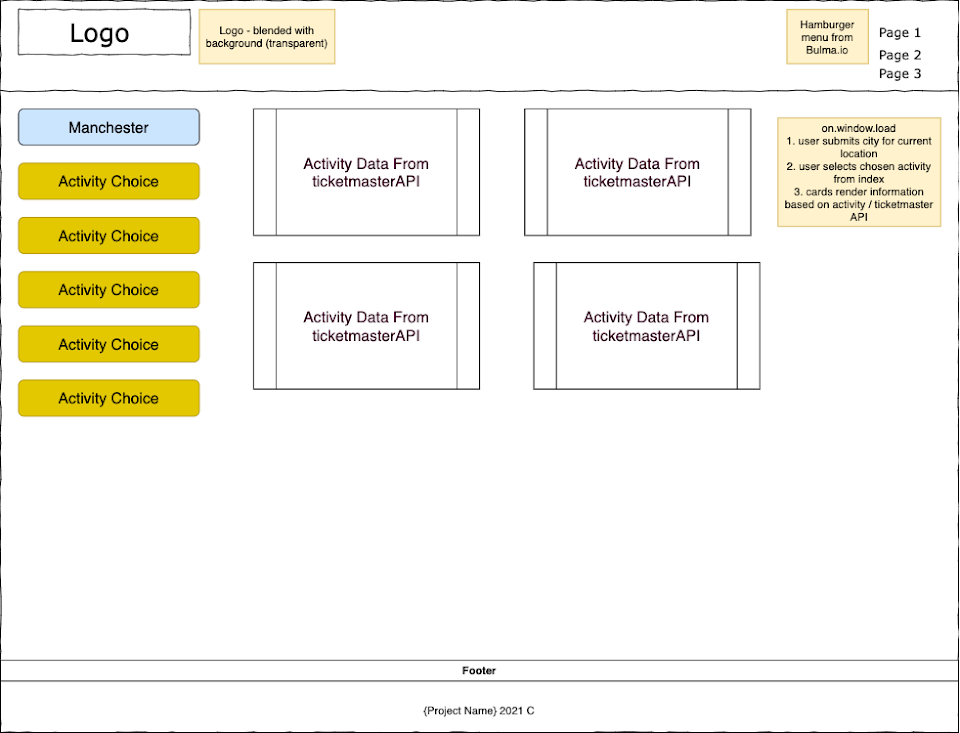

<div style="text-align:center"><a href="https://github.com/conorjkelly96/bored-as-book/"></a></div>

## Table Of Contents

- [Project Link](#project-link)
- [Getting Started](#getting-started)
- [Contributors](#contributors)
- [About The Project](#about-the-project)
  - [Technologies Used](#technologies-used)
  - [Web APIs](#web-apis)
  - [User Flow](#user-flows)
  - [Wireframes](#wireframes)
- [Plans For Improvement](#plans-for-improvement)
- [Screenshots](#screenshots)
  - [Desktop index page with modal](#desktop-index-page-with-modal)
  - [Desktop index page with categories](#desktop-index-page-with-categories)
  - [Desktop index page with randomly generated activity card](#desktop-index-page-with-randomly-generated-activity-card)
  - [Desktop my activities page](#desktop-my-activties-page)
  - [Desktop selected activity search results page](#desktop-selected-activity-search-results-page)
  - [Mobile index page with modal](#mobile-index-page-with-modal)
  - [Mobile index page with categories](#mobile-index-page-with-categories)
  - [Mobile index page with a randomly generated activity card](#mobile-index-page-with-a-randomly-generated-activity-card)
  - [Mobile my activities page](#mobile-my-activities-page)
  - [Mobile selected activities](#mobile-selected-activities)

## Project Link

Click [here](https://github.com/conorjkelly96/bored-as-book) to view the project on Github pages.

## Getting Started

- Clone the Github Project into your local machine
- Navigate into the project
- Open the project into VSCode
- Open the 'index.html' into your default browser

```
git clone git@github.com:conorjkelly96/bored-as-book.git
cd bored-as-book
code .
```

## Contributors

- Andrada Gacichevici:
- Conor Kelly:
- Matt Palmer:
- Yashemabeth:
- Sumaia Sorna:

## About The Project

An app which allows users to randomly generate a list of activities given a random list of criteria, price, participants. The users will be presented with options and will be able to swipe left (delete) or swipe right (add to basket). API sourced from https://www.boredapi.com/documentation.

Once the user has done navigating their list of activities, they can review their activity bucket-list on the "my boredom list". They will be presented with cards displaying their choices. The uSearch tool bar will allow users to make simple web queries from inside the app to search for activities in their local area. API sourced from https://rapidapi.com/blog/web-search-api-with-python-php-ruby-javascript-examples/.

### Technologies Used

### Web APIs

We used three different APIs to get the required data for this project

- [Bored.API](https://www.boredapi.com/api/)
- [DadJoke.API](https://dadjokes.io/)
- [WebSearch.API](https://rapidapi.com/blog/web-search-api-with-python-php-ruby-javascript-examples/)

### User Flow

- AS a user
- I want to select a category
- SO that a random activity is generated
- IF I select yes
- THEN the activity is saved in my activities
- WHEN in my activities
- I have the option to select remove activity from results
- WHEN selecting a specific result
- THEN a selection of relevant search results are shown
- WHEN I visit the home page, a random joke is shown on the screen.

### Wireframes





## Plans For Improvement

- Add loading modals to indicate that API call is being made
- Add additional API such as Ticketmaster API to provide event information for relevant activity results
- Add Spotify API to provide user with music playlists when they choose music categories

## Screenshots

- Desktop index page with modal
  
- Desktop index page with categories
  
- Desktop index page with a randomly generated activity card
  
- Desktop my activities page
  
- Desktop selected activity search results page
  
- Mobile index page with modal
  
- Mobile index page with categories
  
- Mobile index page with a randomly generated activity card
  
- Mobile my activities page
  
- Mobile selected activities
  
